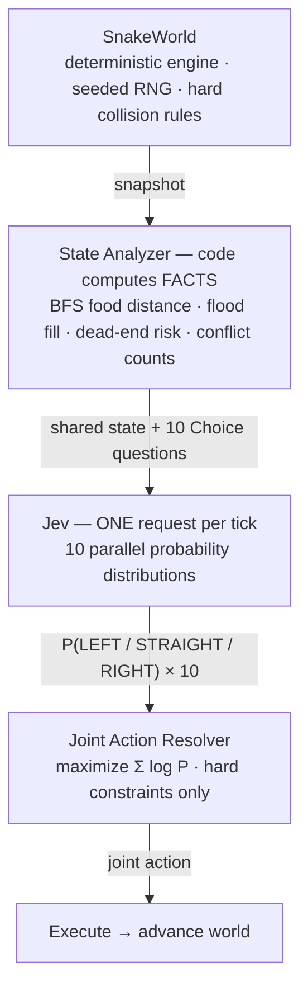

# Jev Swarm — 10-Snake Arena

English | [简体中文](README.zh-CN.md)

<p align="center">
  
</p>

**One world. Ten agents. Ten judgments. One Jev call.**

Jev Swarm is a research playground for [TypeSafe AI's Jev](https://docs.typesafe.ai) — a *"System-One"* model that returns typed decisions instead of text. Ten cooperative snakes share one 30×30 arena, and **every tick sends a single API request carrying all ten snakes' questions**. The model answers with a full probability distribution per snake; a deterministic **Joint Action Resolver** turns those distributions into one collision-free joint action.

The point is not the game. It is a controlled experiment:

> **How much intelligence does one small model contribute to a multi-agent system — and how much comes from the code around it?**

## How it works



**Facts vs judgment.** The model never computes distances, flood fills or collision checks — code hands it precomputed per-action features and it only makes the contextual call. Positions are public physics (each snake sees its own body and every other snake's head); **intentions stay private** — no question may see another question's answer.

**Why full probability distributions matter.** Two snakes will eventually want the same food. Independent judgments cannot negotiate — but because Jev returns the *entire* distribution, the resolver can break the tie deterministically: the snake with the stronger preference takes the cell, the other falls back to its next-best move. Zero extra API calls.

**Survival is not enough.** Snakes that only avoid danger are a failure — the prompt states both team goals explicitly, and the *Rule / Greedy* baseline exists to keep the bar honest.

## What each mode measures

| Mode | Code assist | What it answers |
|---|---|---|
| Random | none | the floor — what pure chance achieves |
| Rule / Greedy | none | a hand-written survival-first heuristic |
| **Jev Raw** | none | **the model alone** — top-1 executed verbatim, deaths count as-is |
| **Jev Joint** | resolver referees | model judgment + deterministic safety net |

The headline diagnostic is the **override rate**, always visible in the UI: if the resolver rewrites most decisions, the code is playing the game — not the model. That is the project's Go/No-Go gate (plan §13): keep the referee dumb, measure the difference.

## Findings so far (real runs, one machine)

- **Prompt design is part of the interface.** A survival-only instruction template made Jev *never eat* — 0 eats in 8 ticks, confidence ~0.42. Stating both goals first-class (with the risk features as guardrails) flipped it: **6–8 eats per 25 ticks, 0 deaths, confidence 0.79–0.88**.
- **A stronger baseline makes the test honest.** Upgrading Rule/Greedy to survival-first-then-max-food raised its own score (generations 7 → 2, food 409 → 552 per 2,000 ticks) — and raised the bar Jev must clear.
- **Parallelism is real.** A 10-question request costs ~0.37 s p50 / ~1.24 s p95 — the model answers ten judgments in roughly the time of one.
- **The resolver is cheap.** 3¹⁰ enumeration with pruning ≈ 0.5 ms; beam search for 20 agents ≈ 22 ms.

## Decision Lens

Click any snake to open its mind for the current tick — full probability bars, the model's proposed move vs the resolver's executed move, the override reason, and the per-action feature table the decision was based on.

<p align="center">
  
</p>

## Run it

```bash
npm install
cp .env.example .env    # paste your TYPESAFE_API_KEY from console.typesafe.ai/keys
npm run dev             # proxy on :8799 + web app on :5173
```

Open <http://localhost:5173>, pick **Jev Joint**, press **▶ 开始**.

- Without a key, Random / Rule modes run fully local and the Jev options stay locked.
- Or paste the key into the in-app **API 密钥** section — it lives in the local proxy's memory only, never written to disk, never sent back to the browser.

## Controls

| Control | Effect |
|---|---|
| Mode | Random / Rule / Jev Raw / Jev Joint |
| Agents | 1 / 2 / 5 / 10 / 20 (N > 12 switches the resolver to beam search) |
| Safety | toggles the Joint Resolver — Jev Raw ↔ Jev Joint |
| Chaos | relocate all food + drop an obstacle cluster, mid-game |
| Seed / Tick ms / Deadline ms | reproducible runs, pacing, decision budget |
| Benchmark | scaling runs (1/2/5/10/20 agents) and 4-mode comparison, CSV/JSONL export |
| 中 / EN | UI language toggle (Chinese by default) |

## Project layout

```
src/game/       deterministic engine: world, collision, features, controllers
src/jev/        shared-state builder (v2) + Choice question templates
src/swarm/      Joint Action Resolver + deterministic fallback
src/sim/        ArenaSimulation — snapshot → decide → apply, per tick
src/benchmark/  metrics recorder, scaling runner, CSV/JSONL export
src/ui/         canvas board, Decision Lens, metrics, controls (zustand + i18n)
server/api.ts   express proxy — keeps TYPESAFE_API_KEY out of the browser
tests/          32 unit tests: collision, resolver, features, controllers, state
```

`docs/plan.md` is the original development plan (Chinese) this implementation follows — including the Definition of Done and the Go/No-Go gates that decide when *not* to keep building.
