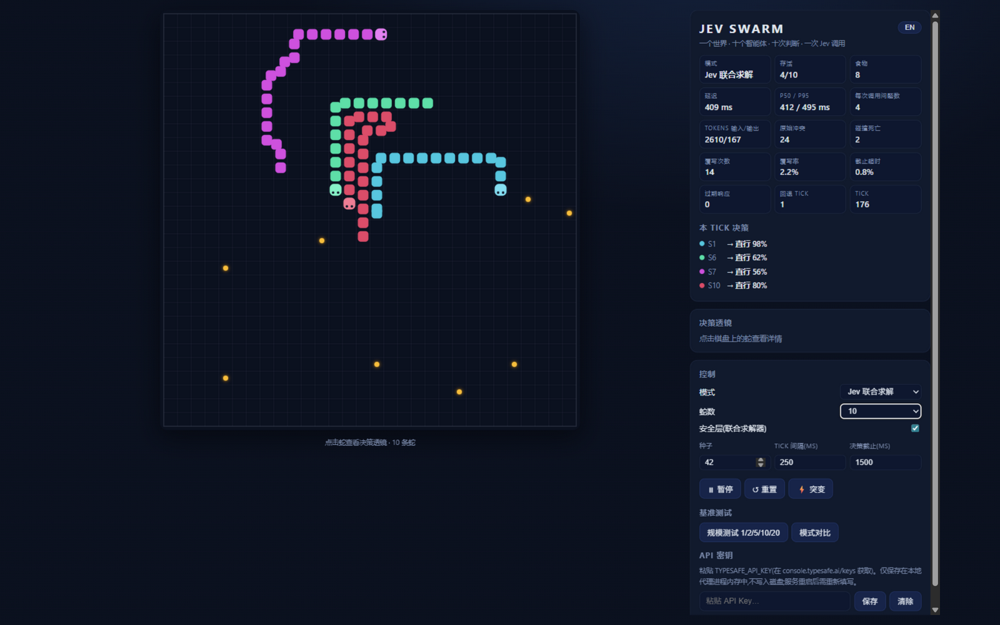
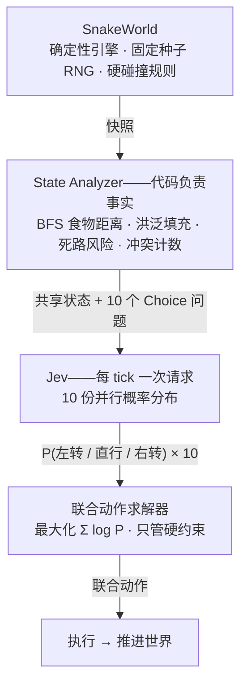
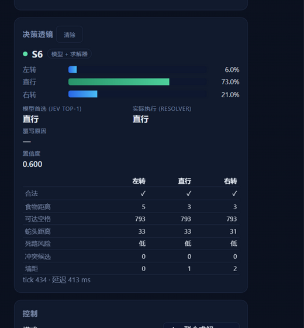

# Jev Swarm — 10-Snake Arena

[English](README.md) | 简体中文

<p align="center">
  
</p>

**一个世界。十个智能体。十次判断。一次 Jev 调用。**

Jev Swarm 是 [TypeSafe AI 的 Jev](https://docs.typesafe.ai) 的研究试验场——这是一个返回**类型化决策**而非文本的 *"System-One"* 模型。十条合作蛇共享同一个 30×30 竞技场,**每个逻辑 tick 只发送一次 API 请求**,内含全部十条蛇的问题。模型为每条蛇返回完整的概率分布;一个确定性的**联合动作求解器(Joint Action Resolver)**把这些分布变成一个无碰撞的联合动作。

重点不是游戏本身,而是一个受控实验:

> **一个小模型能给多智能体系统贡献多少智能——又有多少来自它周围的代码?**

## 工作原理



**事实与判断的分工。** 模型从不计算距离、洪泛填充或碰撞检查——代码把预计算好的逐动作特征递给它,它只做情境判断。位置是公开的物理事实(schema v2:每条蛇能看到自己的蛇身和所有其他蛇的头);**意图保持私有**——任何问题都不允许看到另一个问题的答案。

**为什么完整概率分布重要。** 两条蛇迟早会看上同一个食物。独立判断无法协商——但因为 Jev 返回的是*整个*分布,求解器可以确定性地打破对称:偏好更强的一方拿到格子,另一方自动落到自己的次优选择。零额外 API 调用。

**只活下来不算赢。** 只会避危险的蛇是失败的——提示词里把两个团队目标都明确写出,而 *Rule / Greedy* 基线的存在就是为了把标准立起来。

## 四种模式各测什么

| 模式 | 代码辅助 | 回答的问题 |
|---|---|---|
| Random | 无 | 下限——纯运气能活成什么样 |
| Rule / Greedy | 无 | 手写的"先保命再吃"启发式 |
| **Jev Raw** | 无 | **模型独自作战**——top-1 原样执行,死亡照实计算 |
| **Jev Joint** | 求解器执法 | 模型判断 + 确定性安全网 |

首页常驻的核心诊断指标是**覆写率(override rate)**:如果求解器改写了大部分决策,说明是代码在玩游戏——不是模型。这就是项目的 Go/No-Go 关卡(方案 §13):裁判保持愚蠢,差异才有意义。

## 目前的实测结论(同一台机器的真实运行)

- **提示词设计本身就是接口的一部分。** 只强调生存的指令模板让 Jev *完全不吃东西*——8 个 tick 0 次进食,置信度约 0.42。把两个团队目标都写成一等目标(风险特征只做护栏)之后:**25 个 tick 进食 6–8 次,0 死亡,置信度 0.79–0.88**。
- **更强的基线让测试更诚实。** 把 Rule/Greedy 升级成"先保命、再最大进食"后,它自己的成绩也涨了(2,000 tick / 10 蛇:世代 7 → 2,进食 409 → 552)——Jev 要跨越的门槛随之提高。
- **并行性是真的。** 一次 10 问题的请求耗时约 0.37 s(p50)/ 1.24 s(p95)——模型回答十次判断的时间约等于回答一次。
- **求解器很便宜。** 3¹⁰ 带剪枝的枚举约 0.5 ms;20 条蛇的 beam search 约 22 ms。

## 决策透镜(Decision Lens)

点击任意一条蛇,打开它这一 tick 的"大脑"——完整的左转/直行/右转概率条,模型首选动作与求解器实际执行动作的对比,覆写原因,以及这次决策所依据的逐动作特征表。

<p align="center">
  
</p>

## 运行

```bash
npm install
cp .env.example .env    # 填入你在 console.typesafe.ai/keys 获取的 TYPESAFE_API_KEY
npm run dev             # 代理 :8799 + 网页 :5173
```

打开 <http://localhost:5173>,选 **Jev Joint**,按 **▶ 开始**。

- 没有_key 也能玩:Random / Rule 模式完全本地运行,Jev 选项保持锁定。
- 也可以把 key 粘贴到应用内的 **API 密钥** 区——它只保存在本地代理进程的内存里,不写入磁盘,也不会回传到浏览器。

## 控制项

| 控制项 | 作用 |
|---|---|
| 模式 | Random / Rule / Jev Raw / Jev Joint |
| 蛇数 | 1 / 2 / 5 / 10 / 20(N > 12 时求解器自动切换 beam search) |
| 安全层 | 开关联合求解器——Jev Raw ↔ Jev Joint |
| 突变 | 游戏中重摆全部食物 + 落一组障碍物 |
| 种子 / Tick 间隔 / 决策截止 | 可复现运行、节奏、决策时间预算 |
| 基准测试 | 规模测试(1/2/5/10/20 蛇)与四模式对比,导出 CSV/JSONL |
| 中 / EN | 界面语言切换(默认中文) |

## 目录结构

```
src/game/       确定性引擎:world、collision、features、controllers
src/jev/        共享状态构建器(v2)+ Choice 问题模板
src/swarm/      联合动作求解器 + 确定性回退
src/sim/        ArenaSimulation——每 tick:快照 → 决策 → 应用
src/benchmark/  指标记录、规模测试运行器、CSV/JSONL 导出
src/ui/         画布棋盘、决策透镜、指标面板、控制区(zustand + i18n)
server/api.ts   express 代理——把 TYPESAFE_API_KEY 挡在浏览器之外
tests/          32 个单元测试:碰撞、求解器、特征、控制器、状态模式
```

`docs/plan.md` 是本实现所依据的原始开发方案(中文)——包括"完成定义"清单,以及决定**何时该停止建设**的 Go/No-Go 关卡。
